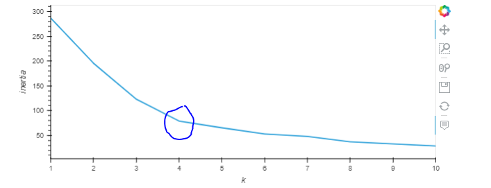
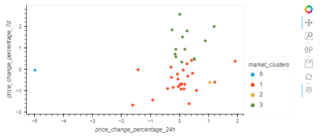
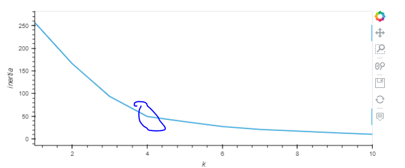
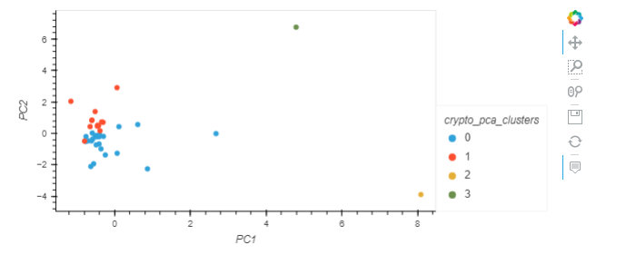

# Cryptocurrency Analysis

The goal of this project was to use the historical returns of various cryptocurrencies over different time periods and cluster them by their performance.

---


## Technologies

This program utilizes Python 3.7 with the following packages:

- [Pandas](https://pandas.pydata.org/) to analyze and manipulate data
- [hvplot](https://hvplot.holoviz.org/) to create interactive data visualizations
- [Path](https://docs.python.org/3.7/library/pathlib.html) to load files from a file path
- [Sklearn](https://scikit-learn.org/stable/) to use the KMeans, PCA and Standard Scaler libraries for unsupervised learning analysis

---

## KMeans Clustering

By first using the KMeans algorithm, we attempted to cluster the cryptocurrencies by the 24-hour and 7-day time periods. This provided a great way to visualize the data clusters, however excluded all other time periods from the analysis. We also determined that 4 would be the appropriate amount of clusters, using the elbow method:








As a next step, we used Principal Component Analysis in effort to compress all of our data and time intervals into three components. 


---

## KMean Clustering with Principal Componenet Analysis


As a next step, we used Principal Component Analysis in effort to compress all of our data and time intervals into three components using the following code. 

```python
pca = PCA(n_components=3)
crypto_pca_data = pca.fit_transform(df_market_data_scaled)
```

With three new columns of data replacing our previous 7 time-intervals,  we repeated the KMeans algorithm by first determining the number of k clusters to use, again with the elbow method. The new clusters appear closer together and more tightly defined than the previous clusters which did not use PCA.







---

## Contributors

This project was created by Matt Wojichowski with the guidance of the University of Washington 2021-2022 FinTech Bootcamp Class.

[Matt Wojichowski LinkedIn](https://www.linkedin.com/in/matt-wojichowski-cfa-caia-93a34a42/)

---

## License

MIT